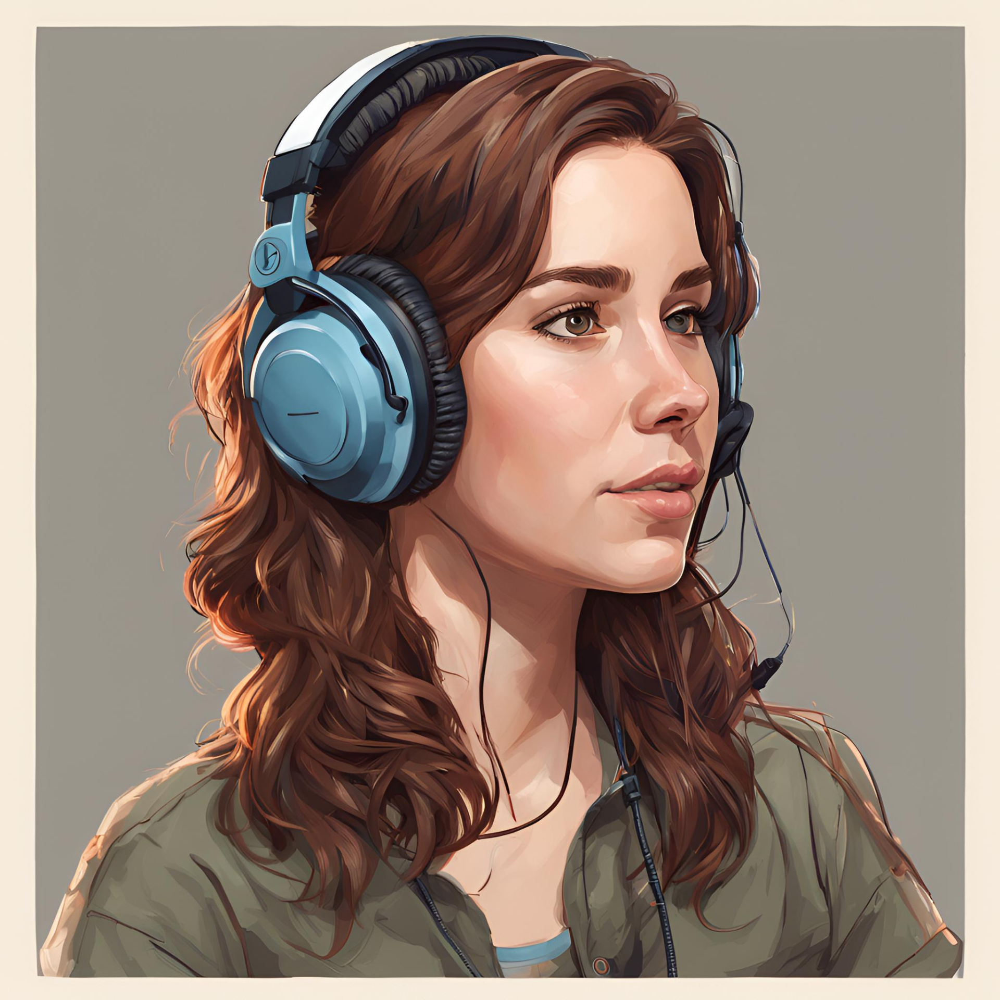
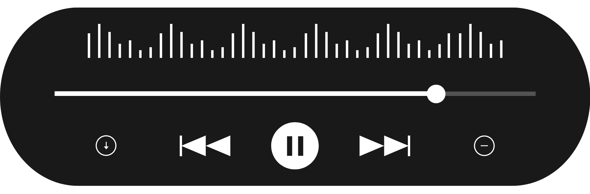

<h3>One Web - A saga da acessibilidade digital</h3>

<audio id="podcast-audio" src="./output/ElevenLabs_acessibilidade_web.mp3"></audio>

Escute ao podcast ⬆️

[Escute ao podcast ⬆️](./output/ElevenLabs_acessibilidade_web.mp3)

 

# Projeto Podcast Gerado por I.A.s

> ℹ️ **NOTE:** Este é o repositório desenvolvido durante o Bootcamp Santander 2024 - Fundamentos de IA para Devs.

Projeto com o objetivo de gerar um podcast utilizando ferramentas de IA através de prompts mais trabalhado.

Utilizer uma esteira de prompts para gerar cada etapa do processo criativo.

 

## 💻 Tecnologias utilizadas no projeto

- [ChatGPT](https://chat.openai.com/)
- [Canva](https://www.canva.com/)
- [ElevenLabs](https://beta.elevenlabs.io/)
- [Capcut](https://www.capcut.com/pt-br/)

 

## ✨ Como foi feito?

- Roteiro gerado via chatgpt
- Audio gerado pela elevenLabs
- Canva - Mídia Mágica AI Para gerar as imagens
- Capcut para tratar aúdio e adicionar sons de fundo

 

## 📄 Prompts

#### ChatGPT:

##### Prompt - Título

Você é um roteirista de podcast, e vamos criar um podcast de tecnologia, focado em história da acessibilidade web, seus marcos mais importantes e influências, e eu gostaria de uma ajuda sua para criar 5 sugestões de nomes criativos para um podcast de acessibilidade web feito por nerds e 5 feito por fãs de anime, e que tenha algum trocadilho no nome.

O podcast vai falar sobre o que é acessibilidade web, quando surgiu, o porquê isso era relevante na época, as mudanças que isso trouxe e a influência no mercado de trabalho de hoje em dia.

{REGRAS}

- O título e um subtítulo deve ser enxuto e simples de compreender
- Deve conter um título e um subtítulo
- O título e um subtítulo deve ter algum trocadilho nerd ou de anime com nomes de franquias famosas.
- O título deve conter alguma palavra forte que remeta a acessibilidade
- O título deve ser em português

{REGRAS NEGATIVAS}

- Não quero que utilize palavras que remetam a linguagens de programação como Python, Java ou Go.
- Não use palavras em inglês ou japonês

 

##### Prompt - Roteiro

Você é um roteirista de podcast, e vamos criar um  roteiro de um podcast de tecnologia, focado na história de acessibilidade web cujo o nome é "One Web - A saga da acessibilidade digital",  com o público alvo de programadores de frontend e interessados em tecnologia.

O formato do roteiro deve ser:
[INTRODUÇÃO]
[O-INICIO]
[O-PORQUÊ]
[MARCOS]
[INFLUÊNCIA-ATUAL]
[FINALIZAÇÃO]

{REGRAS}
- no bloco [INTRODUÇÃO] substitua por uma introdução iguais as introduções dos vídeos do canal 'TED-Ed', como se fossem escritos por um youtuber de programação.
- No bloco [O-INICIO] substitua por quando o conceito de Acessibilidade Web surgiu e seu contexto histórico e social da época.
- No bloco [O-PORQUÊ] engache com o bloco anterior e explique o porquê foi criado o Web Content Accessibility Guidelines.
- No bloco [MARCOS] fale sobre quais mudanças a acessibilibade web trouxe no mundo de tecnologia e sociedade.
- No bloco [INFLUÊNCIA-ATUAL] fale sobre qual a importância da acessibilidade digital nos dias de hoje.
- No bloco [FINALIZAÇÃO] substitua por uma despedida legal e criativa.
- Use termos de fácil explicação
- O podcast vai ser apresentado somente por uma pessoa, chamada Camila
- O podcast deve ser curto

{REGRAS NEGATIVAS}
- Não use muitos termos técnicos
- Não ultrapasse 10 minutos de duração

 

#### Canva - Mídia Mágica AI:

|  Ação  | Prompt                                                                                              |
| :----: | --------------------------------------------------------------------------------------------------- |
| Imagem | Retrato 4:4 extremamente detalhado de uma garota podcaster com cabelos castanhos usando um headset. |
